<picture>
  <source media="(prefers-color-scheme: dark)" srcset="./dark.svg">
  
</picture>

# Hi, I'm Michelle Anto Crazen D

I build intelligent systems across **GenAI, robotics, and the web** — from RAG pipelines and LLM apps to autonomous navigation and full-stack products.

---

## 🌐 Find Me Online

---

## ⚡ Frontier & Core Focus

> **`▸ Agentic AI & Autonomous Workflows`**
> Building multi-agent systems, tool-calling loops, and self-correcting cognitive architectures for complex tasks.

> **`▸ Advanced RAG & Vector Intelligence`**
> Engineering high-precision contextual retrieval, hybrid Graph-RAG, and real-time vector knowledge engines.

> **`▸ Embodied Robotics & Sim-to-Real Control`**
> Applying ROS 2, SLAM, and multimodal sensor fusion to move autonomous agents from simulation into real-world hardware.

> **`▸ Physical AI & Spatial World Models`**
> Training spatial intelligence and reinforcement learning systems to perceive, reason, and interact with 3D environments.

> **`▸ Edge AI & On-Device SLMs`**
> Deploying quantized, low-latency intelligence on NVIDIA Jetson and embedded hardware for offline autonomy.

---

## ⚙️ Tech Arsenal

### 🧠 Languages

`Python` · `Java` · `JavaScript` · `TypeScript` · `SQL`

### 🎨 Frontend

`React` · `Next.js` · `Tailwind CSS` · `Three.js` · `React Three Fiber`

### 🔧 Backend & APIs

`FastAPI` · `Flask` · `Node.js`

### 🤖 AI · Machine Learning

- Machine Learning
- Deep Learning
- Computer Vision
- NLP
- Reinforcement Learning
- Large Language Models (LLMs)
- Retrieval-Augmented Generation (RAG)
- LangChain
- Hugging Face
- Ollama
- FAISS
- ChromaDB

### 🗄️ Data & Databases

- Pandas
- NumPy
- Scikit-learn
- PostgreSQL
- MongoDB
- Firebase

### 🦾 Robotics & Geospatial

- ROS 2
- Gazebo
- NVIDIA Jetson
- Isaac Sim
- Unity
- SLAM
- Path Planning
- A*
- ORB-SLAM
- NetworkX
- Graph Algorithms
- GeoPandas
- Shapely
- OSMnx
- Satellite / Image Processing

### ☁️ Cloud · DevOps · Deployment

- Git
- GitHub
- Docker
- Linux
- AWS
- Vercel
- Render

### ✨ Design & 3D

`Figma` · `Three.js` · `React Three Fiber`

---

## 🛠️ Selected Projects

### [trustmart-ai](https://github.com/Anto-211205/trustmart-ai)

AI-powered trust and verification layer.

`Python` · `FastAPI` · `LLMs`

### [grievance](https://github.com/Anto-211205/grievance)

Intelligent grievance routing system.

`Python` · `NLP` · `Automation`

### [skillsync-ai](https://github.com/Anto-211205/skillsync-ai)

AI skill matching and career intelligence.

`Python` · `RAG` · `Vector Search`

### AURA

AI-powered mental wellness and emotional support platform.

`LLMs` · `LangChain` · `Full-Stack`

### Sim-to-Real Navigation

Deep reinforcement learning and multimodal sensor fusion.

`ROS 2` · `Deep RL` · `Sensor Fusion`

---

## 📊 GitHub Activity

---

Shipping intelligent systems · GenAI · Robotics · Full-Stack

